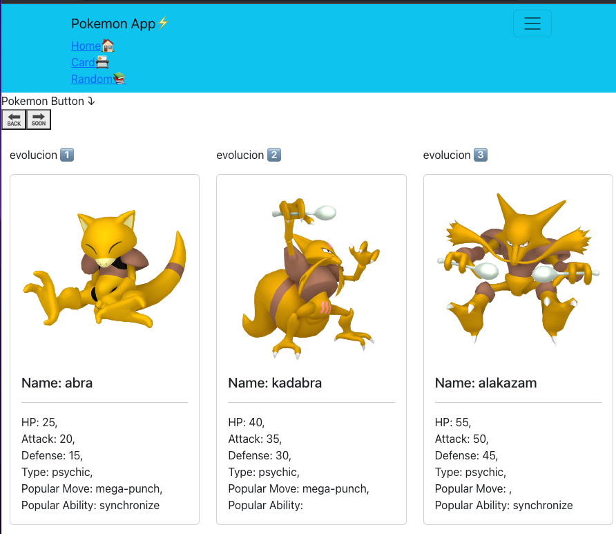
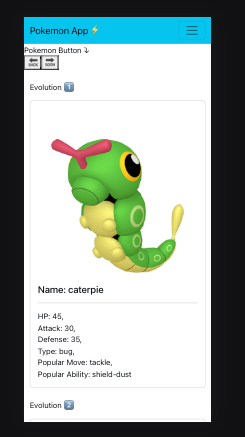

# Pokemon App⚡️
 

# Pokemon App⚡️ Mobile responsive📲
 

# LIVE URL. 👇
 [Live site = WWWW](https://main.d2066zgqqlyzwb.amplifyapp.com "Live site = WWWW") 

## Documentation PokeApi
[Pokemon API information](https://pokeapi.co/docs/v2/ "Pokemon API information") 

## Api
[Pokemon API](https://pokeapi.co/api/v2/pokemon/ "Pokemon API")

## React bootstrap
[React-Bootstrap](https://react-bootstrap.github.io/components/dropdowns/ "React-Bootstrap")

## React Icons
[React-Icons](https://react-icons.github.io/react-icons/ "React-Icons")

## Programming Languages
 HTML, CSS, JavaScript, React, Redux.👈

## Contributor
 [Daniel Moros](https://github.com/Ddmoros "Daniel Moros") 

